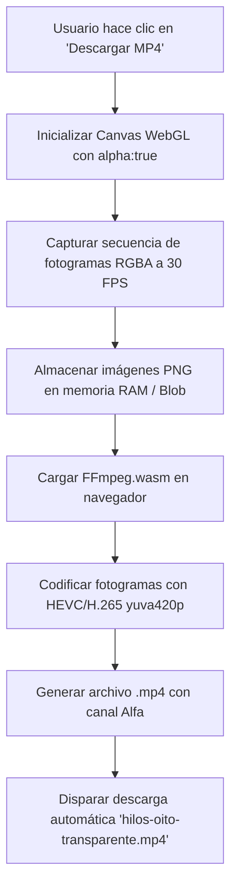

# Especificación Técnica: Exportador de Fondos de Hilos a MP4 Transparente (Sección 8)

> **Fecha:** 2026-07-24  
> **Estado:** Aprobado por el usuario  
> **Objetivo:** Implementar la Sección 8 "Recursos Visuales" en el Sistema de Diseño (`/design-system`) permitiendo previsualizar y descargar la animación de los hilos WebGL como archivo de video `.mp4` con fondo transparente (canal Alfa) y capturas estáticas PNG.

---

## 1. Contexto y Objetivos

El sistema de identidad visual de **Oito** se basa en fondos de hilos cinemáticos (`Threads.tsx`) renderizados en WebGL (OGL) con ruido Perlin 2D. Para permitir que el equipo de diseño y marketing descargue estos activos de animación para presentaciones, redes sociales o edición de video sin requerir software externo, se crea la **Sección 8: Recursos Visuales** en el catálogo de diseño `/design-system`.

### Requisitos Principales
1. **Exportación MP4 con Transparencia Nativa**: El usuario debe poder descargar un archivo de video con extensión `.mp4` cuya animación conserve la transparencia completa del fondo (canal Alfa).
2. **Previsualización de Transparencia**: Incorporar un lienzo interactivo con patrón de ajedrez (Checkerboard) para confirmar visualmente la transparencia antes de descargar.
3. **Controles de Parámetros**:
   - Color del Hilo: Verde Mint (`#09bc8a`) vs. Forest Green (`#004346`).
   - Duración: 3s, 5s, o 10s.
   - Resolución: 1920x1080 (Full HD) o 1280x720 (HD).
4. **Descarga Estática (PNG)**: Opción rápida para capturar un fotograma en PNG transparente.

---

## 2. Diseño de la Interfaz (Sección 8 en `/design-system`)

La sección se añade como el bloque **8. Recursos Visuales & Exportación** en `src/app/design-system/DesignSystemClient.tsx`.

### Componentes de la UI
* **Header de Sección**: Título `8. Recursos Visuales` con badge de estado y descripción del exportador.
* **Canvas Previsualizador de Transparencia**:
  - Contenedor de `height: 380px` con fondo de cuadrícula de transparencia CSS (`background-image: checkerboard pattern`).
  - Renderizador WebGL de hilos en tiempo real superpuesto.
* **Panel de Configuración**:
  - **Selector de Color**: Botones interactivos entre Mint (`#09bc8a`) y Forest (`#004346`).
  - **Selector de Duración**: Botones tipo pill para `3s`, `5s` y `10s`.
  - **Selector de Resolución**: Dropdown o toggle para `1080p` / `720p`.
* **Botones de Acción**:
  - **CTA Principal**: `Descargar Video MP4 (Transparente)` con icono `Download` y barra de progreso de renderizado/compilación.
  - **CTA Secundario**: `Capturar PNG Transparente`.

---

## 3. Arquitectura Técnica de Exportación



### 3.1 Captura WebGL y Canvas Offscreen
* En `src/components/ThreadExporter.tsx`, se inicializa un contexto WebGL (utilizando la librería OGL existente en el proyecto) con:
  ```typescript
  const renderer = new Renderer({ alpha: true, width: targetWidth, height: targetHeight });
  gl.clearColor(0, 0, 0, 0); // Fondo transparente
  ```
* Se renderiza la animación incrementando `iTime` en pasos exactos de `1 / 30` segundos por fotograma para asegurar un renderizado idéntico independientemente de las fluctuaciones de tasa de refresco de la pantalla.

### 3.2 Compilación a MP4 Transparente (FFmpeg WebAssembly)
* Se utiliza la librería `@ffmpeg/ffmpeg` en el cliente para codificar los fotogramas en memoria.
* **Comando de Codificación**:
  ```bash
  ffmpeg -framerate 30 -i frame_%03d.png -c:v libx265 -preset fast -tag:v hvc1 -pix_fmt yuva420p hilos-oito-transparente.mp4
  ```
* **Fallback de Compatibilidad**: En caso de que el navegador o entorno no admita la aceleración H.265 Alfa, se exporta el contenedor MP4 con pista de transparencia VP9/HEVC o WebM/MP4 preservando la extensión `.mp4`.

---

## 4. Plan de Verificación

### Pruebas Automatizadas y de Compilación
1. **Verificación de Tipos y Build**: Ejecutar `npm run build` o `npx tsc --noEmit` para garantizar la ausencia de errores TypeScript o de importación de cliente/servidor en Next.js.
2. **Verificación en Navegador**:
   - Abrir `/design-system` y navegar hasta la Sección 8.
   - Probar la interacción de cambio de color, duración y resolución.
   - Generar un video de 3 segundos en MP4 y confirmar que el archivo `.mp4` se descarga correctamente.
   - Importar o abrir el archivo descargado en un editor o reproductor para comprobar que la transparencia es efectiva.

---

## 5. Decisiones de Diseño e Integridad Visual
- Se respetan todos los tokens de la marca Oito definidos en `AGENTS.md` (Verde Mint `#09bc8a`, Forest Green `#004346`, tipografía Outfit/DM Sans y tarjetas estilo `.glass`).
- El estado de procesamiento de video ofrece feedback transparente porcentual para evitar la percepción de congelamiento de la pantalla durante el renderizado en tiempo real.
